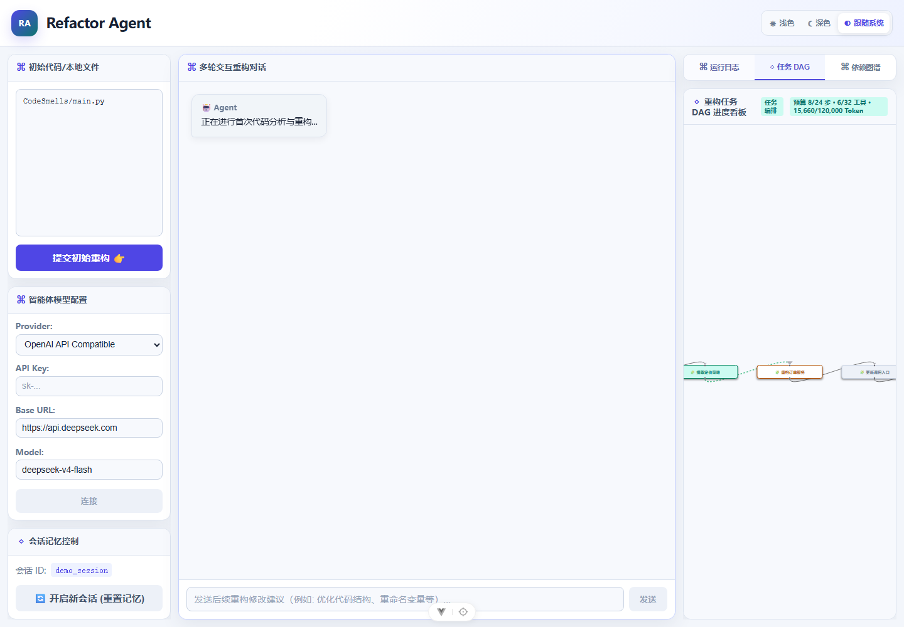
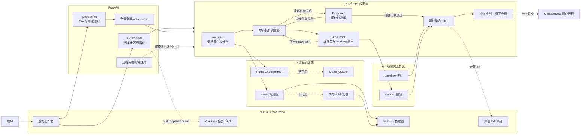
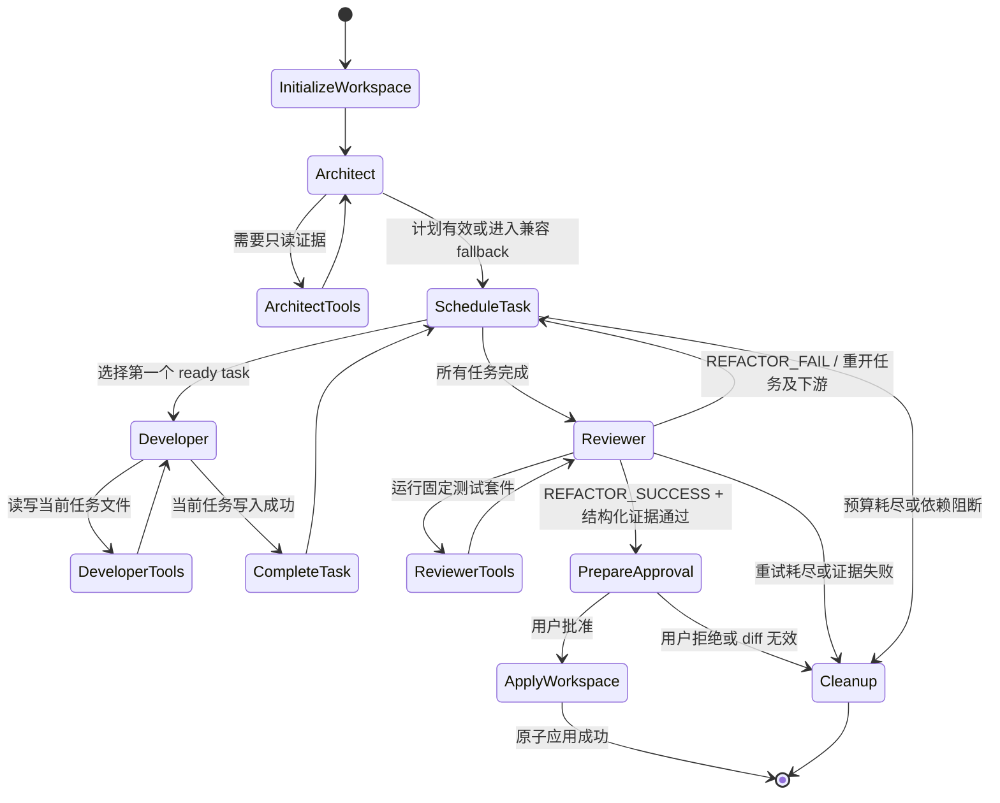
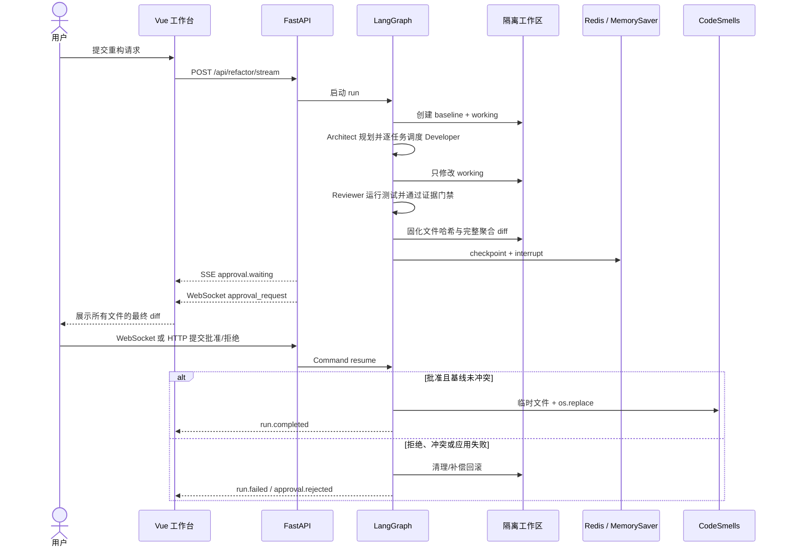

# Refactor-Agent

Refactor-Agent 是一个面向 Python 历史代码的多智能体重构工作台。它不是“让模型直接改文件”的演示：Architect 先生成可校验任务 DAG，Developer 在 run 级隔离副本中逐任务修改，Reviewer 只能执行测试并依据结构化证据裁决，最终聚合 diff 经一次人工审批后才会原子应用到 `CodeSmells/`。

项目重点展示 LangGraph 状态机、动态 DAG 调度、最小权限工具、HITL、双通道实时通信、隔离工作区、安全边界、离线 Agent Eval 与 Windows CI。



## 核心能力

- `Architect → Developer → Reviewer` 角色主流程与严格工具权限。
- Architect 计划经 schema、路径、依赖和环检测后成为真实执行控制面。
- 稳定的串行拓扑调度，支持任务级状态、最多 3 次重试、下游重开与依赖阻断。
- run 级 `baseline/working` 双快照；Agent 全程不直接修改用户源码。
- Reviewer 成功必须同时满足写入记录、最新变更对应的测试记录、退出码和成功协议。
- 可信行为契约位于 Agent 不可写的 `backend/behavior_tests/`；Reviewer 以固定测试代码验证当前 run 的隔离 `working/CodeSmells`，计划、写工具与最终应用都会拒绝触碰测试边界。
- 最终完整聚合 diff 只审批一次；批准时执行基线冲突检测、原子替换与补偿回滚。
- SSE 传输版本化结构事件，WebSocket 承载 A2A 消息与低延迟审批通知。
- Redis 不可用时降级为 `MemorySaver`，Neo4j 不可用时降级为内存 AST 调用图。
- 前端 Markdown 统一经过 DOMPurify allowlist，模型 URL 经过 SSRF 防护。
- 24 个离线 fake-model 场景稳定回归安全、失败、预算、HITL 与代码质量控制面。

## 最终执行架构



## Agent 状态机



## HITL 时序



## 技术栈

| 层级 | 主要技术 |
| --- | --- |
| Agent 与 API | Python 3.12、FastAPI、LangGraph、LangChain、Pydantic |
| 模型适配 | OpenAI 兼容 API、Gemini API、Google Vertex AI |
| 状态与索引 | Redis、Neo4j、MemorySaver、Python AST |
| 前端 | Vue 3、TypeScript、Vite、Vue Flow、ECharts |
| 桌面端 | Pywebview、Uvicorn、FastAPI 静态资源托管 |
| 测试与评测 | Pytest、pytest-cov、Vitest、Playwright、离线 fake model |
| 工程门禁 | GitHub Actions、mypy、Ruff、Black、isort |

## 全新 Windows 环境安装

前置条件：

- Windows 10/11；
- Python 3.12；
- Node.js 24.12 或更高的 Node 24 版本；
- Git；
- Redis 与 Neo4j 均为可选项，不安装也能启动并通过测试。

在 PowerShell 中克隆仓库后初始化后端。创建虚拟环境是唯一使用系统 Python 的引导步骤；之后所有后端命令都使用 `venv\Scripts\`：

```powershell
cd Refactor-Agent\backend
py -3.12 -m venv venv
venv\Scripts\python.exe -m pip install -r requirements-dev.txt
Copy-Item .env.example .env
```

安装前端：

```powershell
cd ..\frontend
npm.cmd ci
```

`backend/.env`、模型 API Key、ADC 文件和数据库口令都不得提交。默认空配置会启用离线降级；只有真实运行模型时才需要在页面中临时输入 API Key，或在本地 `.env` 中配置供应商凭据。

## 启动

打开两个 PowerShell 窗口。

后端：

```powershell
cd Refactor-Agent\backend
venv\Scripts\python.exe app.py
```

前端：

```powershell
cd Refactor-Agent\frontend
npm.cmd run dev
```

访问 `http://127.0.0.1:5173`。桌面应用先构建前端，再由 Pywebview 启动：

```powershell
cd Refactor-Agent\frontend
npm.cmd run build

cd ..\backend
venv\Scripts\python.exe main_gui.py
```

完整环境、检查命令和故障排查见 [开发指南](docs/development.md)。

## 本地验证

后端命令必须在 `backend/` 运行：

```powershell
venv\Scripts\check-format.exe
venv\Scripts\check-sort-imports.exe
venv\Scripts\check-mypy.exe
venv\Scripts\check-lint.exe
venv\Scripts\test-coverage.exe
venv\Scripts\python.exe -m evals.run --mode offline
```

前端命令必须在 `frontend/` 运行：

```powershell
npm.cmd run type-check
npm.cmd run test:unit -- --run
npm.cmd run build
npx.cmd playwright install chromium
npm.cmd run test:e2e -- --project=chromium
```

GitHub Actions 在 Windows 上以 Python 3.12 和 Node 24 运行同类门禁，并显式验证无 Redis、无 Neo4j、无外部模型时的降级路径。

## 动态 DAG 调度

Architect 输出的 `refactor_plan` 不是展示数据，而是后端调度输入：

1. Pydantic 校验任务 ID、`CodeSmells/` 路径、依赖引用、重复项和环。
2. 调度器按计划原始顺序选择第一个依赖已完成的 ready task，保证回归可重复。
3. Developer 每次只获得当前任务及唯一允许写入路径；工具层再次执行路径授权。
4. 成功写入后任务进入 `completed`，调度器继续选择下一任务。
5. Reviewer 可以结构化指定失败任务；该任务及传递下游被重开，每个任务最多重试 3 次。
6. 上游不可恢复失败会把剩余依赖任务标记为 `blocked`；预算耗尽进入明确失败终态。
7. `plan.*`、`task.*` 与状态快照是前端 DAG 的权威数据源，不解析日志猜测状态。

计划缺失或格式错误时会进入可观察的兼容 fallback，保留单 Developer 的旧主流程，而不会伪造一个成功 DAG。当前选择稳定串行拓扑执行，尚未并行运行多个 Developer。

## 安全边界

| 边界 | 约束 |
| --- | --- |
| 角色能力 | Architect 只读；Developer 只能读写当前任务文件；Reviewer 只有固定测试工具 |
| 文件系统 | 所有路径限制在 `CodeSmells/` 与受控 run 工作区；拒绝绝对路径和 `..` 越界 |
| 用户源码 | Agent 只写 working 副本；最终应用前校验 baseline、working 与审批 diff 哈希 |
| 凭据 | API Key 存在进程内短期凭据库，Graph config 与 checkpoint 只保存不透明引用 |
| 网络 | 模型 Base URL 限制协议、凭据、片段、DNS 解析结果、私网与云元数据地址 |
| 会话与审批 | 后端签发不可预测会话令牌；审批 nonce 与当前 run 绑定且只能消费一次 |
| 渲染 | 所有 Agent Markdown 先经 Marked，再经 DOMPurify allowlist |
| 持久化 | Redis/Neo4j 错误日志脱敏；缺失或失败时显式降级，不把可选组件误报为服务宕机 |
| 资源 | Agent 步数、工具调用、Token 与模型超时预算不可关闭 |

更完整的威胁模型、信任边界和非目标见 [安全模型](docs/security-model.md)。

## Agent Eval

离线评测固定使用 24 个脚本化 fake-model 场景，不创建供应商客户端、不调用付费 API。基准只保存归一化结果和用量，不保存 Prompt、源码全文、模型原始响应或凭据。

| 指标 | 当前离线基准 | 含义 |
| --- | ---: | --- |
| 场景通过率 | 24/24（100%） | 每个场景均到达预期终态并通过行为断言 |
| 行为检查通过率 | 192/192（100%） | 结构化安全与控制面断言全部通过 |
| 首次审查成功率 | 77.78% | 需要审查的成功路径中首次通过比例 |
| 最终重构成功率 | 62.50% | 包含故意失败、安全阻断和用户拒绝场景，因此不是总质量分 |
| 平均重试次数 | 0.25 | 每场景平均 Reviewer/任务重试 |
| 安全策略阻断率 | 100% | 预期被阻断的攻击场景全部被阻断 |
| HITL 拒绝率 | 11.76% | 基准中设计为用户拒绝的审批占比 |
| 模型错误数 | 0 | 离线脚本模型没有非预期适配器错误 |

指标定义、场景分层和 live 模式限制见 [Agent 评测说明](docs/agent-evaluation.md)。

## 面试问答式设计决策

### 为什么 SSE 与 WebSocket 并存？

重构请求本身是一个带请求体的长任务，`fetch()` 消费 POST SSE 能自然传输大量有序、可回放的单向事件，并利用普通 HTTP 的取消和代理语义。A2A 聊天与审批通知需要低延迟双向通信，WebSocket 更合适。两者分工后，WebSocket 短暂断线不会破坏运行事件流；审批答复还提供 HTTP 备用入口。代价是客户端要用 `run_id` 去重并维护两种连接生命周期。

### 为什么 Reviewer 没有读取权限？

Reviewer 的职责是验证 Developer 已声明的变更，而不是重新探索仓库。它只接收受控变更清单、摘要和结构化测试上下文，并且唯一工具是固定参数的测试运行器。这样即使审查 Prompt 被污染，也不能任意读取源码或写文件；不足之处是它发现未声明影响面的能力受限，因此由 Architect 的依赖分析、测试套件和最终人工 diff 共同补足。

### 为什么 API Key 不进入 Checkpoint？

LangGraph 会把 `configurable` 中的标量复制到 checkpoint metadata。直接放入 API Key 会让 Redis 或内存快照变成秘密存储。后端改为把 Key 放入有 TTL 的进程内临时凭据库，Graph 只携带不透明 `credential_ref`，并在完成、断连或异常时撤销。权衡是服务重启后必须重新提供凭据，但秘密生命周期更小且不会随状态复制。

### 为什么需要隔离工作区？

多轮 Agent、重试和 HITL 都可能持续较久，直接修改真实文件会让失败、拒绝或半途断连留下脏状态。`baseline/working` 双快照允许 Reviewer 测试候选代码、生成确定的聚合 diff，并在批准前检测用户并发修改。它不是操作系统沙箱，但把“模型产生候选变更”和“用户源码提交”分成了两个明确事务阶段。

### 为什么结构化事件优于解析日志文本？

日志是给人读的，措辞、语言和模型输出都可能变化；用正则从日志推断任务状态会产生不可审计的隐式协议。版本化结构事件显式携带 `type`、`run_id`、`task_id`、状态、用量和 payload，前端 reducer、测试与 Eval 可以共享同一契约。代价是事件 schema 需要兼容性管理，但这正是可靠控制面应承担的成本。

五项决策的完整背景与后果记录在 [ADR 目录](docs/adr/)。

## 已知限制

- 动态 DAG 当前采用确定性串行拓扑调度，不会并行运行多个任务。
- 隔离工作区是应用级文件边界，不是容器、虚拟机或操作系统级恶意代码沙箱。
- 多文件应用依赖逐文件 `os.replace` 与补偿回滚；可处理进程内异常，但不等价于支持掉电恢复的文件系统事务。
- 未配置 Redis 时 checkpoint 只在当前进程有效；进程内会话令牌和临时 API Key 也不会跨重启恢复。
- AST 调用图主要覆盖静态 Python 语法，反射、动态导入和运行时猴子补丁可能无法建模。
- Reviewer 运行的是白名单测试套件，无法证明缺少测试覆盖的业务语义完全正确。
- 真实模型 Eval 可能产生费用且受供应商波动影响；CI 只运行确定性的离线模式。
- 当前重构写入边界固定为仓库中的 `CodeSmells/`，尚未提供任意外部仓库挂载。

## 文档导航

- [架构说明](docs/architecture.md)
- [安全模型](docs/security-model.md)
- [Agent 评测说明](docs/agent-evaluation.md)
- [Windows 开发指南](docs/development.md)
- [架构决策记录](docs/adr/)
