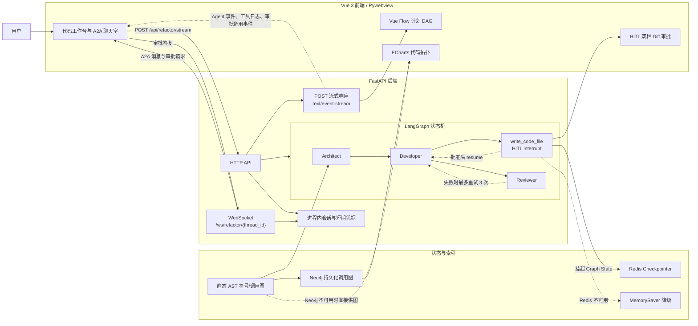
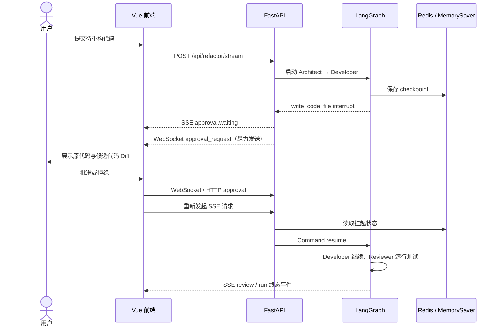
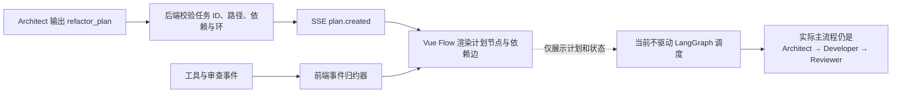

# Refactor-Agent 架构说明

## 系统边界

Refactor-Agent 使用 FastAPI 统一承载会话、模型连接、SSE、WebSocket 和拓扑查询。
LangGraph 保持 `Architect → Developer → Reviewer` 的角色主链，并通过工具权限限制
各角色能力：

| 角色 | 工具权限 |
| --- | --- |
| Architect | `read_code_file`、`search_symbol_definition`、`query_neo4j_topology` |
| Developer | `read_code_file`、`write_code_file`、`search_symbol_definition` |
| Reviewer | `run_unit_tests` |

这里的 SSE 由 `fetch()` 发起 POST 后消费流式响应，而不是浏览器 `EventSource`。
它负责单向、可恢复地传输版本化 Agent 事件。WebSocket 负责低延迟双向消息；
审批请求也会同时经 SSE 发出，因此 WebSocket 暂时不可用时仍能显示 HITL 弹窗，
审批答复则可通过 WebSocket 或 HTTP 备用接口提交。

## HITL 与状态恢复

Redis 是首选 LangGraph checkpointer。未设置 `REDIS_URL` 或 Redis 连接失败时，工作流
自动使用 `MemorySaver`，不会阻止本地运行；代价是进程退出后 checkpoint 消失。

## 代码索引与 Neo4j 降级

后端启动时扫描 `CodeSmells/`，生成 AST 符号索引和直接调用关系。若 Neo4j 可用，
索引会写入项目隔离的图数据；若连接或写入失败，拓扑 API 和 Architect 查询工具改用
内存 AST 调用图。降级模式保留基本节点和调用边，但不提供数据库持久化能力。

## 计划 DAG 的当前语义

动态 DAG 当前是**计划可视化**：后端校验 Architect 输出的任务结构，前端据此布局，
并把文件工具、审批和审查事件映射到节点状态。当前版本尚未为每个任务创建独立执行
单元，也不会根据依赖边进行逐任务排队、并行或失败传播；真正的调度仍由现有 LangGraph
角色主链完成。
