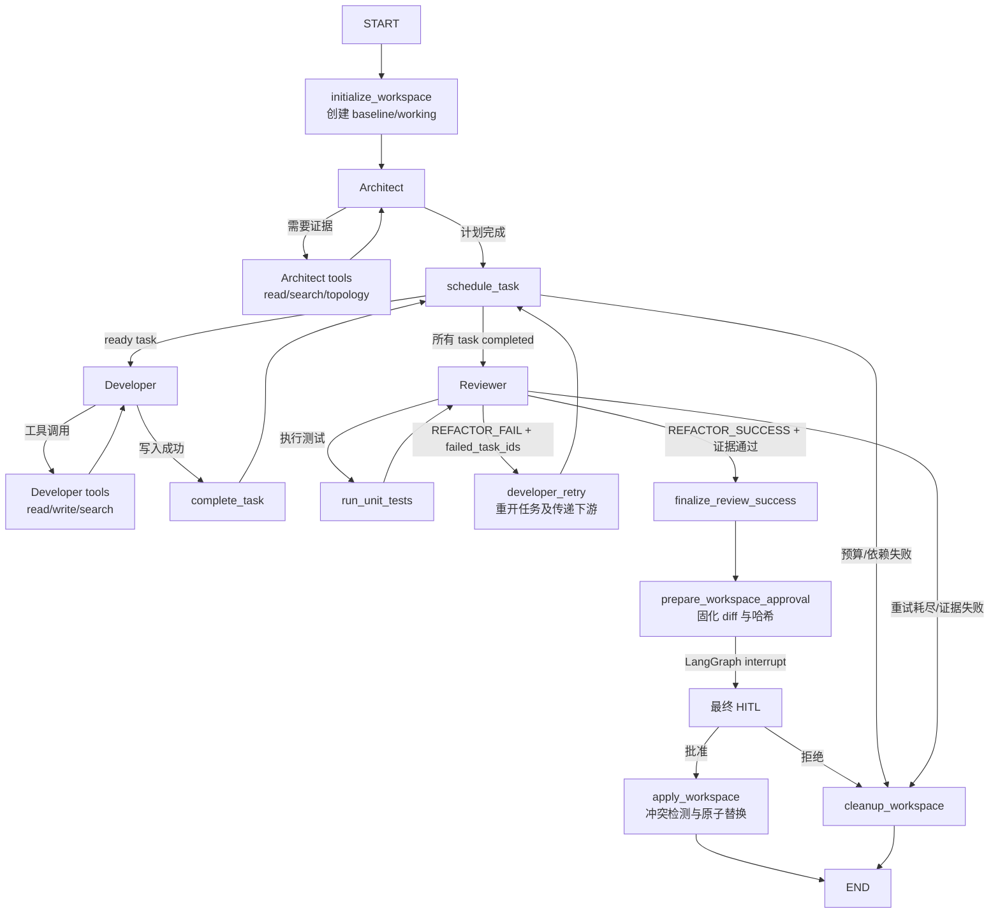
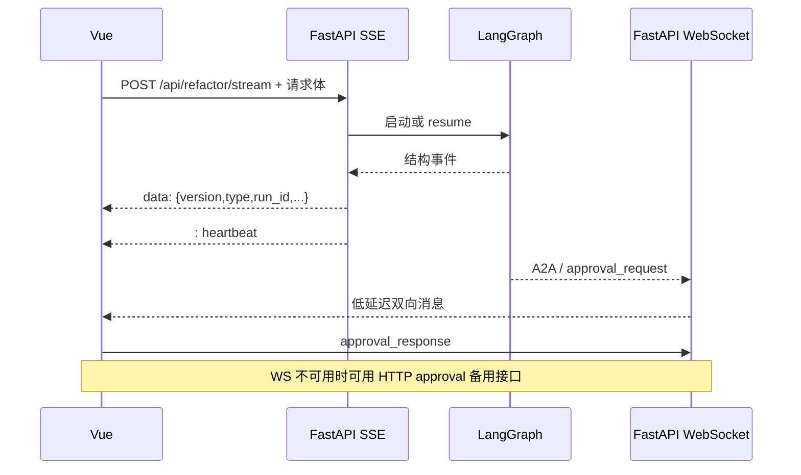

# Refactor-Agent 架构说明

本文描述当前代码实际执行的控制面、数据面与降级路径。入口代码位于 `backend/app.py`，LangGraph 编排位于 `backend/agent/workflow.py`，任务调度与隔离工作区分别位于 `backend/agent/scheduler.py` 和 `backend/agent/workspace.py`。

## 1. 架构目标

系统围绕四个不变量设计：

1. 逻辑角色主链始终是 `Architect → Developer → Reviewer`。
2. 模型输出只能产生候选变更，不能直接提交到用户源码。
3. Reviewer 的成功文本不是充分条件，必须同时通过结构化证据门禁。
4. Redis、Neo4j 与外部模型是增强能力，缺失时服务仍应以可观察方式降级。

## 2. 运行时组件

| 组件 | 职责 | 主要实现 |
| --- | --- | --- |
| FastAPI | 会话、模型配置、SSE、WebSocket、审批与健康检查 | `backend/app.py` |
| LangGraph | 角色节点、工具循环、条件路由、checkpoint 与中断恢复 | `backend/agent/workflow.py` |
| 计划校验 | 规范化任务 ID、路径、依赖与无环性 | `backend/agent/plans.py` |
| DAG 调度器 | ready task 选择、任务状态、重试、下游重开与阻断 | `backend/agent/scheduler.py` |
| 隔离工作区 | 双快照、聚合 diff、哈希固化、原子应用和清理 | `backend/agent/workspace.py` |
| 工具边界 | 文件路径授权、固定测试 argv、角色工具集合 | `backend/agent/tools.py` |
| 事件协议 | 版本化 `run.*`、`plan.*`、`task.*`、`tool.*`、`approval.*` | `backend/agent/events.py` |
| 会话注册表 | 后端签发令牌、单 run lease、一次性审批 nonce | `backend/session_registry.py` |
| 临时凭据库 | API Key 的 TTL 保存、解析与撤销 | `backend/agent/credentials.py` |
| AST/Neo4j 索引 | 符号检索、调用图写入与 AST 降级拓扑 | `backend/code_indexer.py`、`backend/graph_indexer.py` |
| Vue 客户端 | SSE reducer、WebSocket、审批、DAG 与图谱视图 | `frontend/src/` |

## 3. 真实执行路径



Architect、Developer、Reviewer 仍是唯一具有模型决策的角色。调度器、证据门禁、工作区应用和预算熔断属于确定性控制节点，不改变角色主链。

## 4. 动态任务 DAG

### 4.1 计划成为控制面

Architect 的计划必须包含版本、摘要和任务数组。每个任务包含稳定 ID、标题、描述、唯一目标文件和依赖 ID。`validate_refactor_plan()` 会拒绝：

- 空或重复任务 ID；
- 未知、自依赖或重复依赖；
- 有环依赖；
- 不在 `CodeSmells/` 下的路径；
- 路径越界、绝对路径与非法扩展名；
- 超过任务数量等 schema 上限。

验证失败不会把非结构化文本包装成假 DAG，而是把 `plan_status` 标为 `fallback`。兼容路径仍经过单 Developer、Reviewer 与最终隔离应用，不绕过安全门禁。

### 4.2 确定性拓扑调度

调度器按 Architect 给出的原始顺序扫描任务，选择第一个“所有依赖已完成”的任务。选择串行且稳定的原因是：

- 同一计划在本地、CI 和 Eval 中产生一致事件序列；
- 避免两个 Developer 同时写同一文件或交叉接口；
- checkpoint 恢复只需要一个 `active_task_id`；
- Reviewer 打回后的重开集合可确定复现。

Developer 上下文包含当前任务、已完成依赖和唯一允许写入路径。即使模型忽略指令，`write_code_file` 仍会在工具层比较当前任务目标路径。

### 4.3 失败、重试与阻断

- 每个任务最多尝试 3 次。
- Developer 未产生成功写入时记录结构化失败，再由调度器决定是否重试。
- Reviewer 可返回 `failed_task_ids`；指定任务及其所有传递下游从完成态重开。
- 依赖失败且不存在 ready task 时，剩余任务进入 `blocked`，计划进入失败终态。
- Agent 步数、工具调用、总 Token 或模型超时预算耗尽时，走预算失败节点并清理工作区。

### 4.4 权威事件

后端发出版本 1 结构事件，前端不从自然语言日志推断状态。核心事件包括：

| 事件 | 语义 |
| --- | --- |
| `run.started` / `run.completed` / `run.failed` | run 生命周期 |
| `run.usage.updated` | 预算用量和上限快照 |
| `plan.created` / `plan.completed` / `plan.failed` | 计划生命周期 |
| `task.started` / `task.completed` / `task.failed` / `task.blocked` | 任务权威状态 |
| `tool.started` / `tool.completed` | 受控工具执行 |
| `review.completed` | Reviewer 结构化结果 |
| `approval.waiting` / `approval.rejected` | 最终人工门禁 |

所有事件携带 `run_id`；任务事件携带 `task_id`。前端 reducer 会忽略旧 run 的迟到消息，避免新会话被过期 WebSocket 数据污染。

## 5. Reviewer 证据门禁

Reviewer 没有文件读取或写入工具，唯一工具是 `run_unit_tests`。成功终态必须同时满足：

1. 至少存在一次成功的 Developer 写入；
2. 测试记录与最新变更摘要绑定，Developer 再写入后旧证据失效；
3. 测试套件覆盖 `CodeSmells/`；
4. 测试进程退出码为 0；
5. 工具输出包含成功标记；
6. Reviewer 文本包含 `【REFACTOR_SUCCESS】`；
7. Reviewer 的结构化结果与当前任务/计划状态一致。

任一条件缺失都会重试 Reviewer、打回 Developer 或进入失败终态。模型声明“测试已通过”不能伪造工具证据。

## 6. 隔离工作区与最终应用

每个 run 创建一个不可预测工作区 ID，目录结构为：

```text
.refactor-workspaces/
  <workspace_id>/
    baseline/
      CodeSmells/
    working/
      CodeSmells/
```

`baseline` 保存 run 开始时的用户源码快照，`working` 是 Developer 和 Reviewer 的唯一操作目标。最终审批前：

1. 比较两份快照生成跨文件统一 diff；
2. 固化 baseline、working 的逐文件 SHA-256；
3. checkpoint 保存 diff、哈希、变更文件清单，不保存 API Key；
4. LangGraph `interrupt` 暂停状态机。

批准恢复后，应用节点重新验证：

- baseline 快照未被篡改；
- working 快照与用户看到的 diff 一致；
- 用户真实 `CodeSmells/` 仍与 run 开始时的 baseline 哈希一致。

应用阶段先在每个目标同目录创建并关闭临时文件，随后用 `os.replace` 替换。已有文件会先移动到备份；任一步失败时按逆序执行补偿。拒绝、预算失败、测试失败、断连和异常终态都会清理 run 工作区，并保持用户源码不变。

这提供应用级事务语义，但不是支持机器掉电恢复的文件系统事务；相关边界见 [ADR-0005](adr/0005-isolated-workspace-atomic-apply.md)。

## 7. SSE 与 WebSocket



SSE 使用 `fetch()` 读取 POST 响应流，而不是浏览器 `EventSource`。它负责运行的有序事实流，并支持 AbortController 断连释放 run lease。WebSocket 负责聊天和审批的交互体验；审批请求也会发出 SSE 事件，所以通知通道中断不会隐藏待审批状态。

## 8. Checkpoint 与凭据生命周期

Redis 可用时使用 `RedisSaver` 保存 LangGraph checkpoint；无 `REDIS_URL` 或连接/setup 失败时使用 `MemorySaver`。健康检查把降级原因报告在 `components.redis`，但总服务仍为 `ok`。

API Key 不进入 Graph State 或 checkpoint metadata。请求处理器将其放入进程内 `EphemeralCredentialVault`，Graph config 只携带随机 `credential_ref`。节点调用模型时解析引用；运行完成、异常或 SSE 断连时撤销引用。会话 token 同样不进入 checkpoint。

## 9. AST 与 Neo4j

后端启动时扫描 `CodeSmells/`，建立稳定符号 ID 和静态直接调用边：

- 有 Neo4j URI、用户名和密码且连接成功：写入持久化图；
- 凭据缺失、连接失败或写入失败：保留内存 AST 图；
- 拓扑 API 查询 Neo4j 失败：返回 AST 图并设置 `fallback: true`。

Neo4j 错误只记录异常类型，不输出口令。AST 模式能覆盖静态 Python 定义和常规调用，但不能完整表示反射、动态导入或运行时修改。

## 10. 前端状态分层

前端入口 `App.vue` 只负责编排，状态按职责拆分：

- `useBackendSession`：会话建立和 token 生命周期；
- `useRefactorStream`：SSE、取消、事件分发；
- `useAgentChat`：WebSocket 和 run 过滤；
- `useApprovalFlow`：审批展示、WS/HTTP 提交与恢复；
- `useTaskDag`：计划和任务事件 reducer；
- `useRunBudget`：用量快照；
- `useModelProvider`：供应商配置与不持久化 API Key。

Agent Markdown 统一由 `renderSafeMarkdown()` 渲染，Marked 只负责语法解析，DOMPurify 负责安全 allowlist，外链再补充 `rel="noopener noreferrer"`。

## 11. 关键数据生命周期

| 数据 | 保存位置 | 生命周期 | 是否持久化 |
| --- | --- | --- | --- |
| 用户源码 | `CodeSmells/` | 仓库生命周期 | 是 |
| baseline/working | `.refactor-workspaces/<id>` | 单个 run | 否 |
| Graph State | Redis 或 MemorySaver | 会话/checkpoint | 可选 |
| API Key | 进程内临时凭据库 | TTL 或 run | 否 |
| 会话 token / approval nonce | 进程内注册表 | 会话/run | 否 |
| 结构事件 | SSE/前端内存 | 当前 run | 否 |
| Eval 报告 | `backend/evals/output/` | 本地运行 | 忽略 |
| 离线基准 | `backend/evals/baselines/offline.json` | 版本控制 | 是，白名单字段 |

## 12. 进一步阅读

- [安全模型](security-model.md)
- [Agent 评测](agent-evaluation.md)
- [开发指南](development.md)
- [ADR 索引](adr/README.md)
