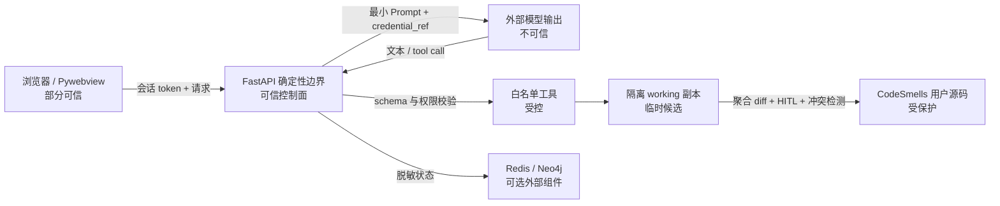

# 安全模型

本文记录 Refactor-Agent 的资产、信任边界、主要威胁和现有控制。目标不是把模型视为可信执行者，而是让确定性控制面约束模型可观察、可写入和可提交的范围。

## 1. 保护资产

- `CodeSmells/` 中的用户源码及其并发修改；
- 模型 API Key、Vertex ADC、Redis/Neo4j 凭据；
- LangGraph checkpoint、会话身份和审批决定；
- 本机文件、内网服务与云元数据端点；
- 浏览器 DOM 和用户审批界面；
- 测试结果、变更摘要与 Eval 报告的完整性。

## 2. 信任边界

模型输出、待重构源码中的注释、用户输入、外部供应商错误和数据库错误都按不可信数据处理。

## 3. 角色最小权限

| 角色 | 允许工具 | 明确禁止 |
| --- | --- | --- |
| Architect | `read_code_file`、`search_symbol_definition`、`query_neo4j_topology` | 写文件、运行命令 |
| Developer | `read_code_file`、`write_code_file`、`search_symbol_definition` | 当前任务以外写入、任意命令 |
| Reviewer | `run_unit_tests` | 读文件、写文件、任意测试参数 |

行为契约测试保存在 Agent 不可写的 `backend/behavior_tests/`。Reviewer 只获得固定套件映射，测试进程通过受控环境变量导入当前 run 的 `working/CodeSmells`；`CodeSmells/tests` 作为旧位置仍被路径策略永久保护，避免候选变更重新创建伪造测试。

Reviewer 通过受控变更清单、摘要、测试上下文和工具证据完成裁决。测试工具把逻辑套件名映射为固定 argv，`shell=False`，不接受自由命令字符串。

## 4. 文件系统边界

文件路径需要同时通过以下约束：

1. 规范化后仍位于 `CodeSmells/`；
2. 拒绝绝对路径、盘符、`..` 和符号解析后的越界；
3. 动态 DAG 模式下写入必须等于当前任务的 `file_path`，读取和符号查询仅覆盖当前任务及其已完成传递依赖；
4. 实际读写被重定向到当前 run 的 `working` 快照；
5. 工作区 ID 必须匹配内部生成格式，清理操作再次验证目标属于 `.refactor-workspaces/`。

最终应用前比较真实源码与 baseline 哈希，避免长时间 Agent 运行或审批期间覆盖用户的新改动。working 和审批 diff 的哈希也会复核，避免“批准 A、应用 B”。

Architect 的全局 AST/Neo4j 只描述用户原始源码。Developer 查询通过注入的 `workspace_id` 对当前 working tree 按需构建私有 AST 快照，不切换进程级全局变量、不把临时源码写入 Neo4j；因此两个并发 run 无法通过索引缓存互相看到候选符号。

## 5. 凭据边界

### 模型 API Key

- Pydantic 使用 `SecretStr` 接收 API Key；
- `build_graph_config()` 排除 `api_key` 和 `session_token`；
- Key 进入有 TTL 的进程内临时凭据库；
- checkpoint 只得到随机 `credential_ref`；
- 节点在调用供应商时即时解析；
- 完成、失败、断连和异常清理路径都会撤销引用；
- 前端 localStorage 只保存非敏感模型选项，显式删除旧版本可能残留的 `api_key`。

### ADC 与数据库凭据

- 客户端请求不能覆盖本机 ADC 路径；
- ADC 状态接口不返回真实文件路径；
- Redis URL 日志移除用户名、口令和查询参数；
- Neo4j 未同时配置用户名与口令时不创建 driver；
- 供应商、Redis 和 Neo4j 错误只暴露必要的异常类别和脱敏定位信息。

## 6. 网络与 SSRF

自定义模型 Base URL 的校验包括：

- 只允许 `http` 和 `https`；
- 禁止 URL 用户名、口令和 fragment；
- 解析所有 DNS 答案，而不是只检查字符串主机名；
- 远程绑定默认拒绝回环、RFC 私网、链路本地等非公网地址；
- 无论部署模式如何都拒绝云元数据地址；
- 本机 loopback 部署可显式连接本地模型服务；
- DNS 解析失败或混合公网/私网答案时失败关闭。

该边界降低 DNS rebinding 和云元数据探测风险，但不能替代生产环境的出口防火墙。

## 7. 会话、并发与审批

- 会话由后端生成不可预测 `thread_id` 与 `session_token`；
- WebSocket 需要 token，并校验同源 loopback Origin；
- 单会话 run lease 阻止两个 DAG 同时写同一 checkpoint；
- 每次最终审批生成随机 `approval_id`，与当前 run 绑定；
- nonce 在同一待审批状态下幂等，做出决定后只能消费一次；
- 旧 run 的 WebSocket 消息由 `run_id` 过滤；
- SSE 断连会取消生产者、释放 lease 并撤销临时凭据。

批准行为只授权应用当前已固化的聚合 diff，不授权后续新变更。

## 8. Reviewer 结构化证据

Reviewer 的自然语言结论只是协议的一部分。成功路由还验证成功写入记录、可信测试套件、退出码、成功标记，以及测试前后完整工作区快照一致。快照按规范相对路径排序并绑定文件类型、大小与内容哈希；`change_records` 只保留 UI/审计用途，不再充当可信源码身份。Developer 新写入会显式清空旧测试记录，外部修改则会在成功终态、聚合审批和正式应用时通过重新计算摘要被拒绝。

这一门禁防止以下失败：

- 模型谎称已经运行测试；
- 测试针对旧候选代码；
- 只运行无关测试；
- 测试命令退出失败但输出包含误导文本；
- Reviewer 输出成功标记但当前任务仍失败或阻断。

## 9. 浏览器渲染

Agent 消息和 WebSocket 聊天都使用统一 `renderSafeMarkdown()`：

1. Marked 解析 GFM；
2. DOMPurify 以标签和属性 allowlist 清洗；
3. 禁止事件处理属性、脚本、iframe、危险 URL；
4. 外部链接增加 `noopener noreferrer`。

禁止组件直接把原始模型文本传给 `v-html`。对应攻击向量由 `frontend/src/__tests__/markdown.spec.ts` 回归。

## 10. 资源与可用性

每个 run 有不可关闭的：

- Agent 步数预算；
- 工具调用预算；
- 总 Token 预算；
- 单次模型调用超时；
- LangGraph recursion limit；
- 单任务重试上限。

预算触发确定性失败终态和工作区清理。SSE 心跳只维持传输，不伪造成业务事件；响应禁止缓存和反向代理缓冲。

## 11. 可选基础设施降级

| 故障 | 行为 | 安全影响 |
| --- | --- | --- |
| 未配置/不可用 Redis | 使用 `MemorySaver` | checkpoint 不跨进程；不绕过 HITL |
| 未配置/不可用 Neo4j | 使用内存 AST 图 | 图谱精度和持久性降低；Architect 仍只读 |
| 未配置模型凭据 | UI/API 可启动，真实重构不可调用模型 | 不使用伪造在线成功 |
| WebSocket 中断 | SSE 仍显示审批状态，HTTP 可提交决定 | 不自动批准 |
| 用户拒绝或连接中止 | 清理候选工作区 | 用户源码保持不变 |

健康检查把 Redis/Neo4j 标为 `degraded`，服务总状态保持 `ok`，便于区分“增强能力不可用”和“安全控制面宕机”。

## 12. 威胁与控制矩阵

| 威胁 | 主要控制 | 回归证据 |
| --- | --- | --- |
| Prompt injection 要求越界写入 | 工具 allowlist、路径规范化、当前任务授权 | `test_security_boundaries.py`、离线安全场景 |
| 命令注入测试工具 | 固定套件枚举、固定 argv、`shell=False` | `test_security_boundaries.py` |
| Reviewer 伪造成功 | 结构化写入/测试证据门禁 | `test_review_routing.py`、`test_review_context.py` |
| API Key 进入 checkpoint | 临时凭据引用、metadata 断言、完成后撤销 | `test_security_boundaries.py` |
| SSRF / 云元数据访问 | URL 结构与 DNS/IP 分类校验 | `test_backend_contracts.py` |
| Markdown XSS | DOMPurify allowlist | `markdown.spec.ts` |
| 过期审批重放 | run lease、一次性 approval nonce | `test_session_registry.py` |
| 批准内容被替换 | baseline/working/final 哈希复核 | `test_isolated_workspace.py` |
| 多文件部分应用 | 同目录临时文件、`os.replace`、补偿回滚 | `test_isolated_workspace.py` |
| 可选服务故障导致绕过 | 显式 MemorySaver/AST 降级并保留门禁 | `test_app_transport.py`、`test_backend_contracts.py` |

## 13. 非目标与剩余风险

- 应用级隔离工作区不是恶意 Python 的 OS 沙箱；测试仍在本机受控 Python 进程中运行。
- AST 索引不是完整语义分析器。
- 补偿回滚不能保证机器掉电场景的跨文件事务恢复。
- 进程内会话和凭据库不适合未经改造的多副本部署。
- 人工批准可以降低误改风险，但不能证明业务语义正确。
- 生产部署仍应增加 TLS、反向代理认证、网络出口策略、进程权限隔离和审计存储。

相关决策见 [ADR 索引](adr/README.md)。
